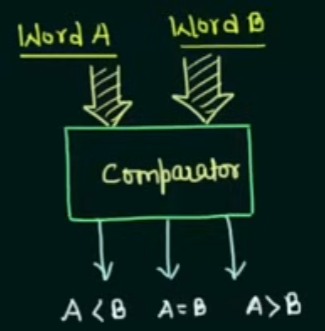
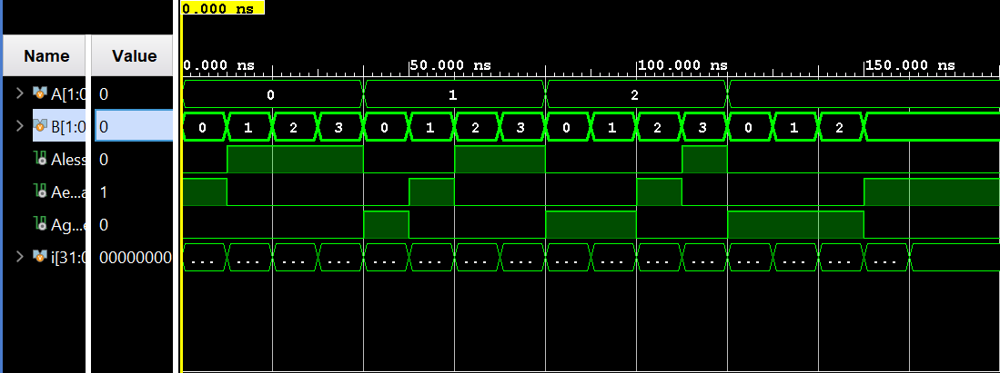

# 2-Bit Comparator | Verilog

A **Verilog implementation of a 2-bit comparator**, designed and simulated in **Xilinx Vivado**.  
This document explains:

- **What a comparator is**
- **How a 2-bit comparator works**
- The **truth table**, **Boolean equations**, and **signal assignments**
- How to **run the design and testbench in Vivado**

The project includes the **RTL design**, **testbench**, **simulation waveform**, and **console-style output** verifying correct behavior.

---

## Table of Contents

- [What Is a Comparator?](#what-is-a-comparator)
- [2-Bit Comparator Basics](#2-bit-comparator-basics)
- [Truth Table and Boolean Equations](#truth-table-and-boolean-equations)
- [Circuit Description](#circuit-description)
- [Waveform Diagram](#waveform-diagram)
- [Testbench Output](#testbench-output)
- [Running the Project in Vivado](#running-the-project-in-vivado)
- [Project Files](#project-files)

---

## What Is a Comparator?

A **comparator** is a combinational logic circuit that compares **two binary numbers** and determines their relationship.  
It produces outputs indicating whether the first number is **less than**, **equal to**, or **greater than** the second number.

Comparators are commonly used in:

- **Digital arithmetic** and **ALU operations**
- **Sorting algorithms** and **data processing**
- **Control logic** for decision-making in digital systems

---

## 2-Bit Comparator Basics

This project implements a **2-bit comparator**. The signals are:

- **A₁, A₀** – first 2-bit input (A)  
- **B₁, B₀** – second 2-bit input (B)  
- **A<B** – output high when A < B  
- **A=B** – output high when A = B  
- **A>B** – output high when A > B

Behavior:

- The comparator compares the two 2-bit numbers A and B.
- Exactly one of the three outputs is high at any time, indicating the relationship between A and B.

---

## Truth Table and Boolean Equations

Using inputs **A₁**, **A₀**, **B₁**, **B₀**, and outputs **A<B**, **A=B**, **A>B**, the complete truth table is:

| A₁ | A₀ | B₁ | B₀ | A<B | A=B | A>B |
|----|----|----|----|-----|-----|-----|
| 0  | 0  | 0  | 0  | 0   | 1   | 0   |
| 0  | 0  | 0  | 1  | 1   | 0   | 0   |
| 0  | 0  | 1  | 0  | 1   | 0   | 0   |
| 0  | 0  | 1  | 1  | 1   | 0   | 0   |
| 0  | 1  | 0  | 0  | 0   | 0   | 1   |
| 0  | 1  | 0  | 1  | 0   | 1   | 0   |
| 0  | 1  | 1  | 0  | 1   | 0   | 0   |
| 0  | 1  | 1  | 1  | 1   | 0   | 0   |
| 1  | 0  | 0  | 0  | 0   | 0   | 1   |
| 1  | 0  | 0  | 1  | 0   | 0   | 1   |
| 1  | 0  | 1  | 0  | 0   | 1   | 0   |
| 1  | 0  | 1  | 1  | 1   | 0   | 0   |
| 1  | 1  | 0  | 0  | 0   | 0   | 1   |
| 1  | 1  | 0  | 1  | 0   | 0   | 1   |
| 1  | 1  | 1  | 0  | 0   | 0   | 1   |
| 1  | 1  | 1  | 1  | 0   | 1   | 0   |

From this table, the Boolean equations for the outputs are derived using Karnaugh maps (K-maps):

**A<B** (K-map groups: one group of 4, two groups of 2):  
A<B = ¬A₁ · B₁ ∨ ¬A₁ · ¬A₀ · B₀ ∨ B₁ · B₀ · ¬A₀

**A=B** (K-map groups: four groups of 1's):  
A=B = (A₁ ⊙ B₁) · (A₀ ⊙ B₀)

**A>B** (K-map groups: one group of 4, two groups of 2):  
A>B = A₁ · ¬B₁ ∨ A₀ · ¬B₁ · ¬B₀ ∨ A₁ · A₀ · ¬B₀

In more programming-style notation:

```text
A<B = ~A1 & B1 | ~A1 & ~A0 & B0 | B1 & B0 & ~A0
A=B = (A1 ~^ B1) & (A0 ~^ B0)
A>B = A1 & ~B1 | A0 & ~B1 & ~B0 | A1 & A0 & ~B0
```

```text
A<B = ~A1 & B1 | ~A1 & ~A0 & B0 | B1 & B0 & ~A0
A=B = (A1 ~^ B1) & (A0 ~^ B0)
A>B = A1 & ~B1 | A0 & ~B1 & ~B0 | A1 & A0 & ~B0
```

These equations capture the key 2-bit comparator behavior:

- **A<B** is true when A is less than B.
- **A=B** is true when A equals B.
- **A>B** is true when A is greater than B.

---

## Circuit Description

The 2-bit comparator circuit uses basic logic gates to realize the Boolean expressions above:

- **OR gates** and **AND gates** for combining terms in A<B and A>B.
- **XNOR gates** for equality checks in A=B (since XNOR is equivalent to ~^ in Verilog).

Conceptual view (textual logic diagram):

```text
A<B logic:
  (~A1 & B1) | (~A1 & ~A0 & B0) | (B1 & B0 & ~A0)

A=B logic:
  (A1 ~^ B1) & (A0 ~^ B0)

A>B logic:
  (A1 & ~B1) | (A0 & ~B1 & ~B0) | (A1 & A0 & ~B0)
```

In the Verilog implementation, these relationships are encoded directly using combinational logic assignments.

---



## Waveform Diagram

The behavioral simulation verifies operation by:

1. Sweeping through all **16 combinations** of inputs A and B.  
2. Observing that exactly one of `A<B`, `A=B`, or `A>B` is high for each combination, matching the truth table.

Signals observed:

```text
Inputs :
  A1, A0, B1, B0
Outputs:
  A<B, A=B, A>B
```

---


## Testbench Output

A conceptual console-style view of the testbench results (matching the design's intended behavior) is:

```text
A = 00, B = 00, A<B = 0, A=B = 1, A>B = 0
A = 00, B = 01, A<B = 1, A=B = 0, A>B = 0
A = 00, B = 10, A<B = 1, A=B = 0, A>B = 0
A = 00, B = 11, A<B = 1, A=B = 0, A>B = 0
A = 01, B = 00, A<B = 0, A=B = 0, A>B = 1
A = 01, B = 01, A<B = 0, A=B = 1, A>B = 0
A = 01, B = 10, A<B = 1, A=B = 0, A>B = 0
A = 01, B = 11, A<B = 1, A=B = 0, A>B = 0
A = 10, B = 00, A<B = 0, A=B = 0, A>B = 1
A = 10, B = 01, A<B = 0, A=B = 0, A>B = 1
A = 10, B = 10, A<B = 0, A=B = 1, A>B = 0
A = 10, B = 11, A<B = 1, A=B = 0, A>B = 0
A = 11, B = 00, A<B = 0, A=B = 0, A>B = 1
A = 11, B = 01, A<B = 0, A=B = 0, A>B = 1
A = 11, B = 10, A<B = 0, A=B = 0, A>B = 1
A = 11, B = 11, A<B = 0, A=B = 1, A>B = 0
```

These results confirm that the outputs follow the expected 2-bit comparator behavior.

---

## Running the Project in Vivado

### 1. Launch Vivado

Open **Xilinx Vivado**.

### 2. Create a New RTL Project

- **Create Project**  
- Choose **RTL Project**  
- Enable **Do not specify sources at this time** (optional) or add them directly.

### 3. Add Design and Simulation Files

Design Sources (RTL):

```text
twoBitDecoder.v
```

Simulation Sources (Testbench):

```text
twoBitDecoder_tb.v
```

Set `twoBitDecoder_tb.v` as the **simulation top module**.

### 4. Run Behavioral Simulation

In Vivado:

```text
Flow -> Run Simulation -> Run Behavioral Simulation
```

Observe the signals:

```text
Inputs : A1, A0, B1, B0
Outputs: A<B, A=B, A>B
```

Verify from the waveform that the outputs follow the **truth table** and match the console-style output listed above.

---

## Project Files

| File                | Description                                                |
|---------------------|------------------------------------------------------------|
| `twoBitDecoder.v`   | RTL implementation of the 2-bit comparator                 |
| `twoBitDecoder_tb.v`| Testbench that stimulates the comparator and records waveforms |

---

**Author**: **Kadhir Ponnambalam**
